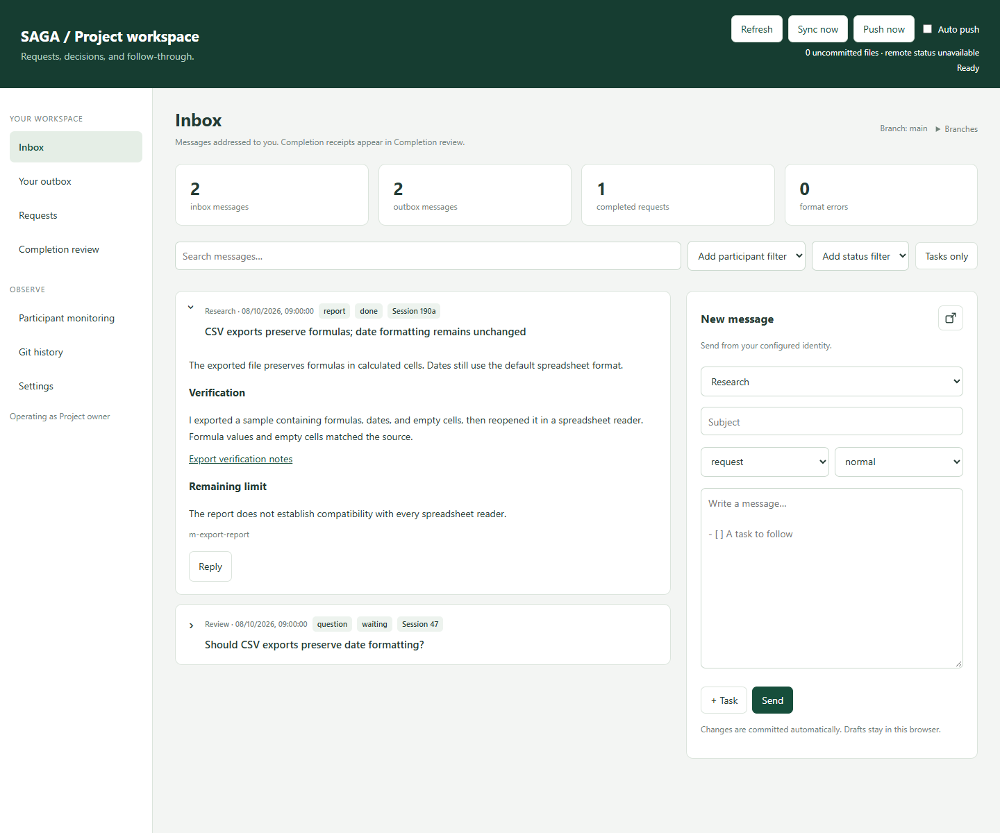
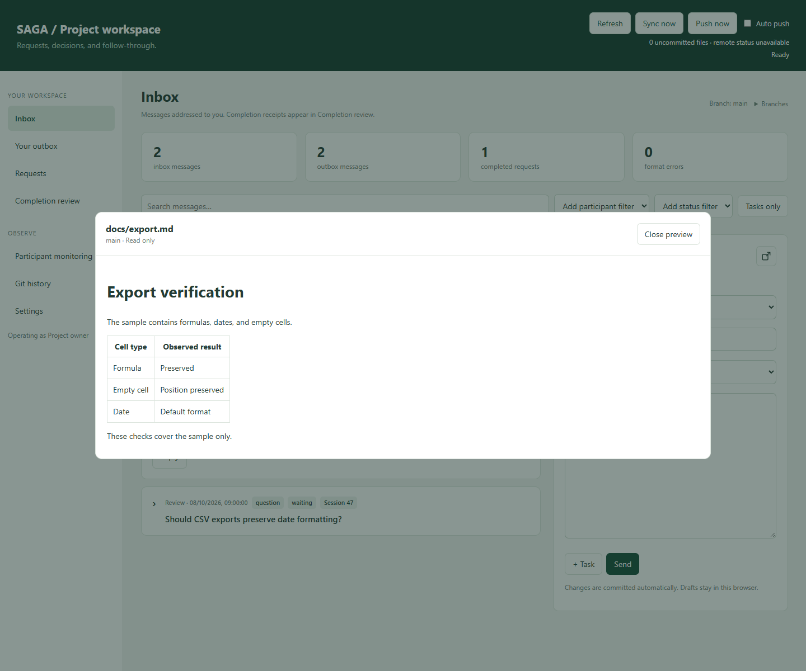
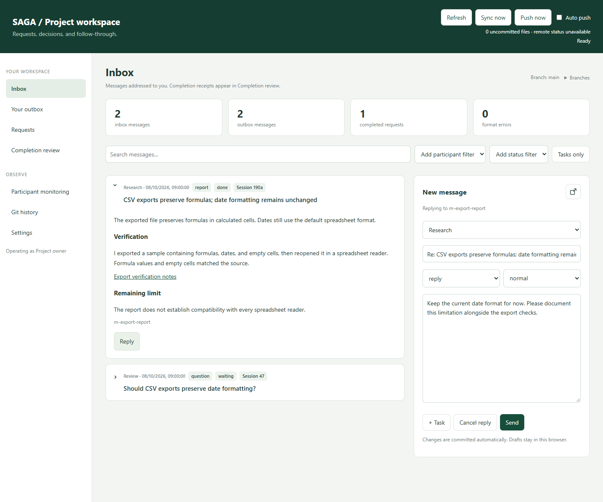
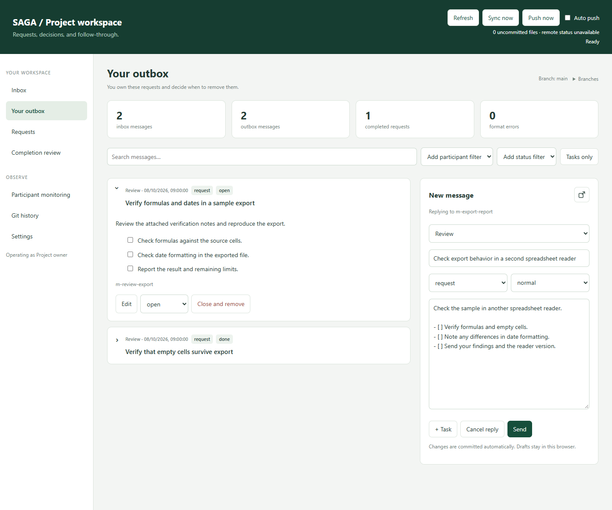
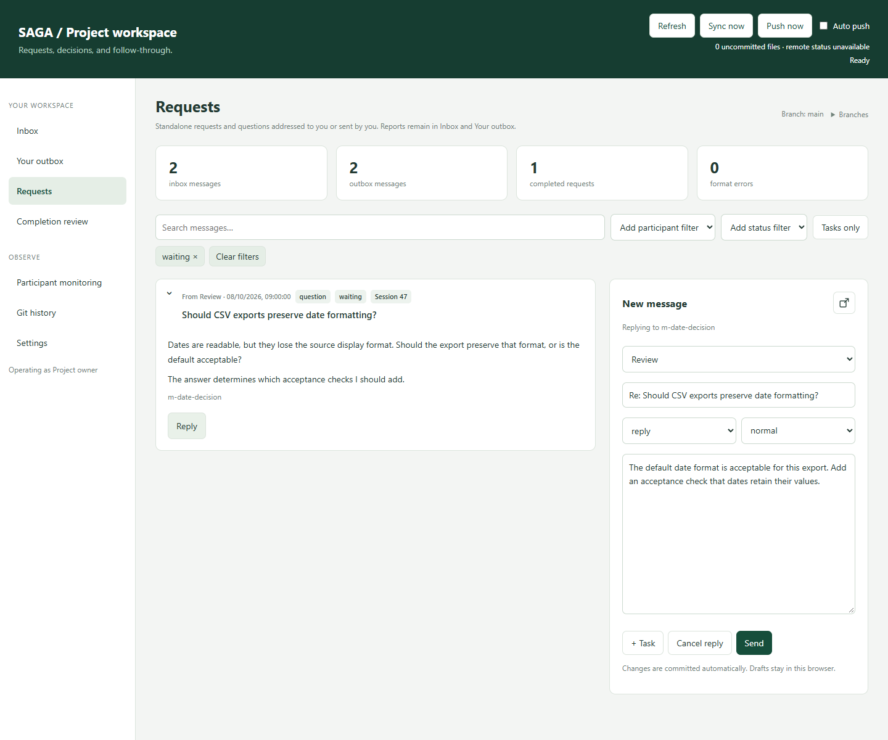
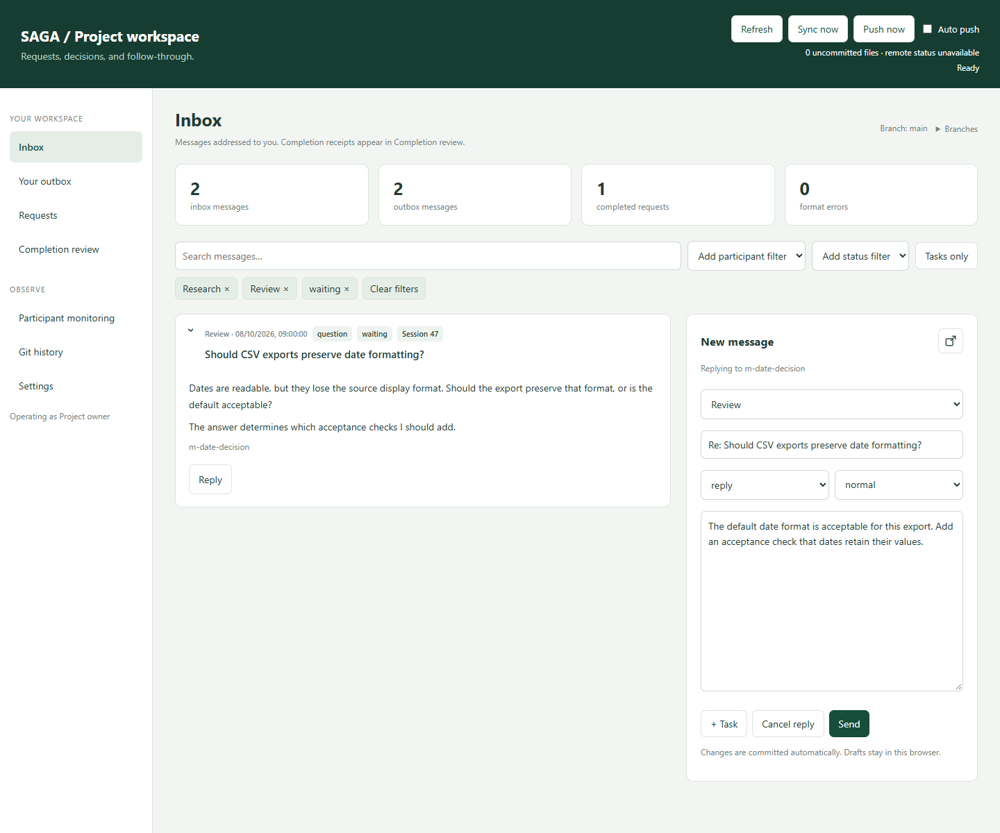
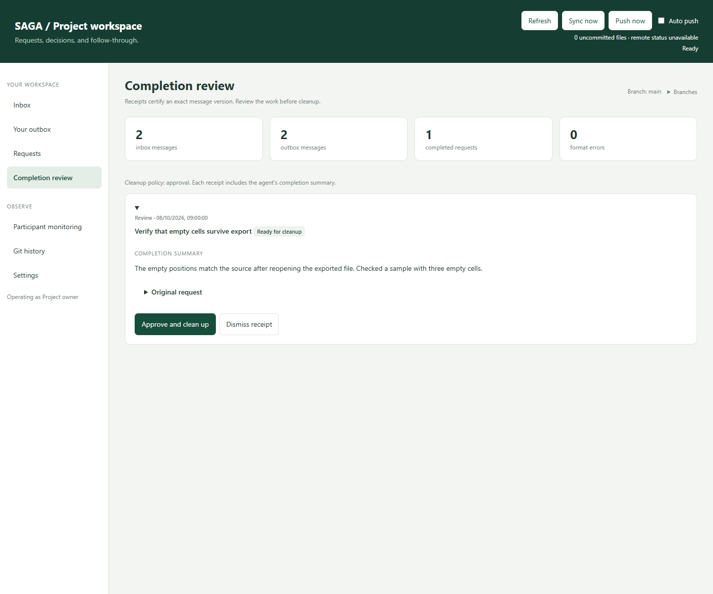
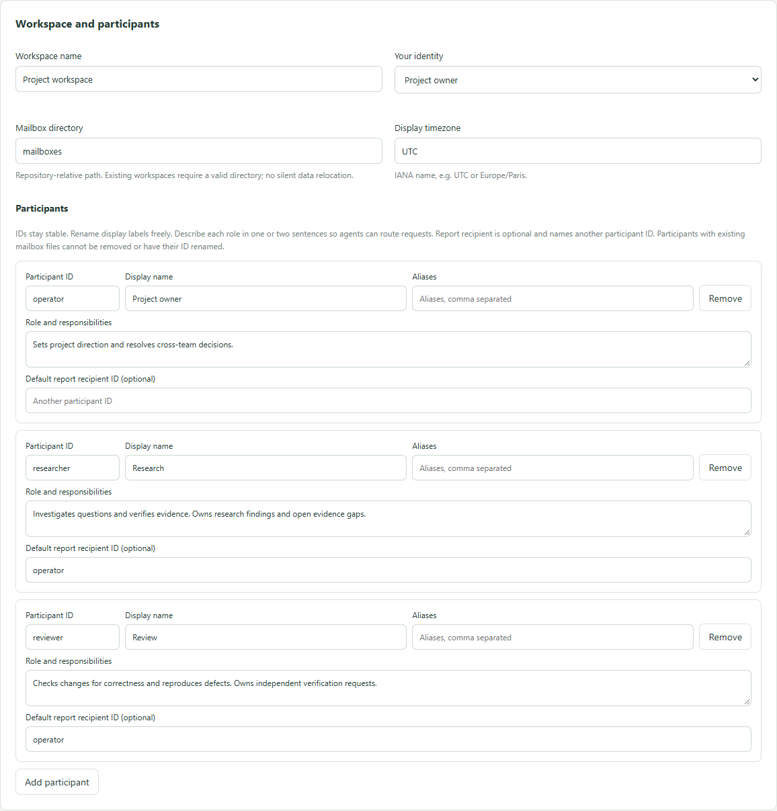
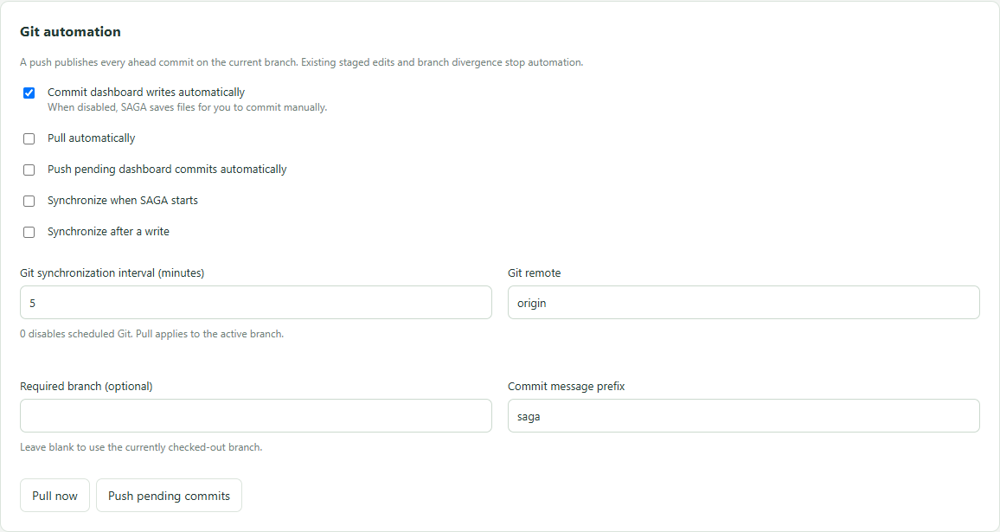

# SAGA

SAGA is the communication and supervision component of a workflow with agents scheduled to act repeatedly and autonomously on a project. Each agent has a role, reads incoming requests on each run, works within its scope, and sends reports or blocking questions through Git-backed Markdown mailboxes. The dashboard lets you follow their work, give instructions, answer blockers, and review completion without opening every agent session.

Your agent platform provides execution and regular scheduling. SAGA provides shared communication and your control interface. It runs separately from your communication/documentation repository, keeping private messages outside the application's source tree.

The project is in an early trial. The interface uses the name **SAGA**; workspace names and participant labels are your own.

## Start

Requires **Node.js 22+** and **Git**. There are no runtime packages to install.

```sh
git clone https://github.com/Ignia-org/SAGA.git SAGA
cd SAGA
npm start
```

Open [SAGA locally](http://127.0.0.1:4318). On the first run, enter your Git repository's absolute path and either open its existing workspace or initialize mailboxes. The selected path is remembered in ignored local state (`.saga/local.json`), outside the managed repository's configuration.

To select a configured repository directly:

```sh
npm start -- /path/to/your/repository
```

On Windows, double-click `Start.cmd`. Keep the terminal open. Set the `PORT` environment variable to use a different listening port. Repository selection and settings changes do not require a restart; changing the listening port does.

## Getting started

Set up one recurring task per agent, with a stable participant ID and a defined role. Each run handles incoming messages, continues useful work within its scope, then reports results and sends separate requests for decisions or blockers. Manual runs test the setup; the operating model is agents returning at regular intervals while you supervise them in SAGA. Their schedules are independent of SAGA's refresh and Git intervals.

### Prepare communication and access

Create and clone your own dedicated Git repository for communication and internal documentation. From the SAGA checkout, initialize participant IDs:

~~~sh
node src/cli.mjs init --root /path/to/team-docs --identity operator --participants operator,researcher,reviewer --title "Team workspace"
~~~

Here `operator` is your dashboard identity; `researcher` and `reviewer` are agent IDs, not platform accounts. Give each recurring task its own ID and role. Organize agent instructions however you prefer. A durable state file is recommended for memory and session numbering between runs; its name and structure are yours.

Provide Node.js 22+, Git, repository access, and the role's tools in each environment. Keep one communication checkout per agent with a common publication branch. Commit and push the initial configuration and mailboxes. Open your own checkout in SAGA and choose Git synchronization settings. Scheduling stays in the agent platform.

### ChatGPT / Codex recurring agent

Add the agent's communication checkout as a local project in the desktop app's Work/Codex environment. From the SAGA checkout, install its portable skill:

~~~sh
node src/cli.mjs install-skill --root /path/to/team-docs --destination .agents/skills/saga-mailbox
~~~

Commit and push the copy. The agent receives the skill and bundled CLI without access to SAGA itself. Optionally reference it in `AGENTS.md`. [OpenAI skill setup](https://learn.chatgpt.com/docs/build-skills).

Use this recurring prompt, adapting the role and paths:

~~~text
Your participant ID is researcher; your role is to investigate and verify project questions.
Communication repository: /path/to/team-docs. Report recipient: operator.
Read and follow /path/to/team-docs/.agents/skills/saga-mailbox/SKILL.md.
On each run, handle incoming work and continue autonomously within this role.
Report results and send separate requests for decisions or blockers through the skill.
In the communication repo, pull safely, validate, commit your own changes, and push to origin/main.
~~~

Test once, then create a recurring task in Scheduled with that project, prompt, and cadence, for example hourly. Alternatively ask in the role chat: “Schedule these instructions every hour for this local project.” Select local execution and configure the required file and Git access. Run now verifies that the scheduled environment can load the skill and publish a report. Local runs need the computer awake and the app running; web-only schedules cannot edit this checkout. [OpenAI scheduled tasks](https://learn.chatgpt.com/docs/automations?surface=app).

### Claude recurring agent

In Claude Desktop's Code tab, select the agent's communication checkout as its working folder. From SAGA, install the same portable skill in Claude's project directory:

~~~sh
node src/cli.mjs install-skill --root /path/to/team-docs --destination .claude/skills/saga-mailbox
~~~

Commit and push the copy so the agent receives its skill and helpers. Optionally reference it in `CLAUDE.md`. [Claude skill setup](https://code.claude.com/docs/en/skills).

Use this recurring prompt:

~~~text
Your participant ID is reviewer; your role is to review project changes and identify concrete defects.
Communication repository: /path/to/team-docs. Report recipient: operator.
Read and follow /path/to/team-docs/.claude/skills/saga-mailbox/SKILL.md.
On each run, handle incoming work and continue reviews autonomously within this role.
Report results and send separate requests for decisions or blockers through the skill.
In the communication repo, pull safely, validate, commit your own changes, and push to origin/main.
~~~

In Routines, choose New routine, Local, this working folder, these instructions, and a regular schedule such as hourly. Configure the permission mode and required tools, then test Run now and review its first report. Local tasks require the computer awake and the app open. Claude Code CLI's `/loop` serves session polling; this setup uses Desktop's persistent local schedule. [Claude Desktop scheduling](https://code.claude.com/docs/en/desktop-scheduled-tasks).

### Keep the loop coherent

Adapt the sample roles, scope, branch, and commit/push authorization to your project. If agents also work in another repository, configure its access and Git policy explicitly. Stagger runs and avoid overlap for the same agent. Stop and report dirty-checkout or divergence problems rather than resetting work. Isolated worktrees or cloud clones need a defined publication path to the branch your dashboard pulls.

An agent may keep its memory in a state file, or use another durable mechanism. Its scheduler or state supplies session numbering: an independent run uses `190`; returning to that completed run uses `190a`, then `190b`. The next independent run uses `191`. Session references are optional, separate from descriptive titles. The skill defines the continuation rules.

## Try the example

```sh
npm run demo
```

This creates a separate local Git repository under ignored `.saga/demo`, with synthetic messages, tasks, a completion receipt awaiting review, and participant-to-participant traffic. It never imports real project data. Open the same local URL. Existing demo data is preserved on subsequent runs.

## Dashboard

- **Inbox**: messages addressed to your configured identity.
- **Your outbox**: requests and messages you own; edit, reply, update tasks, or close them.
- **Requests**: actionable request/question records, separate from reports.
- **Completion review**: exact-version completion receipts, with optional cleanup approval.
- **Participant monitoring**: read-only conversations between other participants.
- **Git history**: inspect mailbox snapshots before and after a commit.
- **Settings**: repository, identities, paths, display preferences, intervals, and every automatic Git or cleanup action.

Each sender owns their outbox. Recipients write completion receipts in a separate stream. Cleanup removes only the operator's matching request and its valid completion receipts; other participants remain responsible for their own outboxes. A receipt is the recipient's statement that the work is complete. SAGA does not independently verify the work.

## Everyday interactions

The screenshots use a synthetic workspace with a project owner, a researcher, and a reviewer. Names and roles are examples; your directory supplies your own participants.

### Read an agent's report

Open **Inbox**, add that agent using the participant filter, and expand a card whose title interests you. The card shows its sender, type, status, and optional session reference. A continuation such as `190a` remains separate from the original report.



A repository Markdown link opens a read-only preview without leaving the dashboard. PDF links open a separate tab. The message should explain the finding before requiring you to open a supporting file.



### Reply to a report

Click **Reply** on the report. The composer selects the sender and links the answer to that message; write your response and choose **Send**. Your reply appears in **Your outbox**, while the recipient receives it through their next synchronized inbox read. You can keep the report visible while writing, or detach the composer with its expand-window icon.



### Send an agent a task

Choose the participant, write a concrete subject, and use type **request**. Describe the expected result and add Markdown checklist items (or use **+ Task**) for actions that need tracking. Set a priority where appropriate, then send. This example asks the reviewer to reproduce export checks in another reader.



### Answer a blocking request

Open **Requests** to see requests and questions sent by or addressed to you, apart from reports. Filter by a waiting or blocked status when useful. Expand the question and click **Reply** to state your decision. In this example, the owner accepts the default date format and specifies which acceptance check the reviewer should add. A reply does not by itself mark work completed or remove the original message; its owner closes it after the decision or work has been handled.



### Combine filters

Add several participants or statuses to accumulate filter chips. Alternatives within one category are combined with OR; participant and status categories are combined with AND. Here the inbox includes Research or Review, and only messages waiting for an answer. Remove a chip individually or choose **Clear filters**. Text search and **Tasks only** further narrow the current view. Messages remain ordered by creation time.



### Review completion and clean up

An agent that finishes your request writes a completion receipt tied to the exact message version. **Completion review** shows its result beside the original request. With review-based cleanup, choose **Approve and clean up** once satisfied; this consumes the matching receipt and removes your fulfilled request. A changed request or blocked receipt does not qualify. Git retains the history.



### Describe participants centrally

In **Settings**, fill in each participant's **Role and responsibilities** in one or two sentences and optionally set a **Default report recipient ID**. The visible field labels distinguish the stable ID, display name, aliases, role, and reporting contact. Save settings to update the shared directory.

Agents obtain it with `node <skill-directory>/scripts/cli.mjs participants --root <workspace>`. The skill uses declared responsibilities for relevant requests and findings, while each agent's prompt retains its own scope and inbox priorities. An explicit reporting recipient in the task takes precedence over the directory's default. This avoids copying every contact rule into every prompt; it does not require broadcasting every report.



### Choose synchronization behavior

**Refresh** rereads local files. In **Settings → Git automation**, choose automatic commits, pulls, pushes, startup/after-write sync, and the Git interval independently. **Send** saves the message locally; it reaches another checkout after publication and synchronization. Check the header's uncommitted/ahead indicators, or use **Push now** when publishing manually. The screenshot shows the defaults, with automatic pulls and pushes still off.



## Settings and defaults

Workspace settings are stored in `exchange.config.json` in the managed repository. The Settings form validates and applies changes immediately.

| Setting | Default | Behavior |
|---|---|---|
| Interface refresh | 60 seconds | `0` means manual; otherwise 10–86400 seconds |
| Automatic commits | Enabled | Commits only files written by SAGA |
| Automatic pulls / pushes | Disabled | Each is independently enabled |
| Git interval | 5 minutes | Pulls the active branch; `0` disables scheduled Git |
| Branch discovery | Enabled | Discovers local and remote Git branches without a list |
| Automatic branch fetch | Disabled | Independently refreshes all remote branches |
| Branch fetch interval | 5 minutes | Configurable from 1 to 1440 minutes |
| Sync on startup / after writes | Disabled | Explicit switches |
| Remote / required branch | `origin` / unrestricted | Optional branch guard |
| Cleanup | Review required | Automatic or disabled are also available |
| Receipt scan interval | 300 seconds | Runs only in automatic cleanup mode |
| Manual cleanup confirmation | Enabled | Can be disabled independently |
| Display timezone | `UTC` | No project-specific timezone is baked in |
| Page size / expanded cards | 50 / 0 | Configurable to suit large histories |
| Default type / priority / status | request / normal / open | Used for new messages |
| History commits | 60 | Configurable, up to 200 |
| Commit prefix | `saga` | Configurable |

Identity, participant IDs/labels/aliases, mailbox directory, and monitoring visibility are configurable too. Participant IDs stay stable; changing labels is safe. Existing mailbox directories must be valid before selecting them; SAGA does not silently relocate data. Initialize a new layout with the setup screen or CLI.

**Refresh** only rereads files. **Sync now** follows your configured pull/push switches. Settings also offers explicit **Pull now** and **Push pending commits** actions. Automatic cleanup requires automatic commits so its history is retained. With manual commits, SAGA saves edits to disk and leaves committing to you.

Git operations stop for staged work, dirty files, mismatched branches, or divergence. SAGA does not stash, reset, merge, or rebase automatically. A push publishes all ahead commits on that branch. Publication holds in local Git config (`saga.publicationHold`, with compatibility for `dashboard.publicationHold`) remain effective independently of UI settings. Pending publication is tied to its originating branch.

## Agent skill

The portable skill is [skills/saga-mailbox/SKILL.md](skills/saga-mailbox/SKILL.md). It includes the protocol reference and dependency-free helper scripts, so it can be used from this checkout or copied into a skill directory supported by your agent.

Read the skill from your project's agent instructions, or optionally install a copy:

```sh
node src/cli.mjs install-skill --root /path/to/workspace --destination .claude/skills/saga-mailbox
```

Choose the destination for your agent platform. The installer does not overwrite an existing skill. Updates to a copied skill are explicit. New messages use plain words rather than decorative emojis.

## CLI and protocol

```sh
node src/cli.mjs init --root /path/to/repository --identity operator --participants operator,contributor --title "My workspace"
node src/cli.mjs validate --root /path/to/repository
node src/cli.mjs list --root /path/to/repository --to contributor
node src/cli.mjs receipt m-request-id --root /path/to/repository --from contributor --body-file result.md
```

The CLI writes files but never stages, commits, or pushes them. [PROTOCOL.md](docs/PROTOCOL.md) defines the Markdown record format, ownership rules, receipt hashes, and remaining commands.
The header shows uncommitted file counts and commits ahead/behind the locally known remote branch. Refresh does not fetch Git; remote counts update when Git synchronizes. **Push now** publishes the current branch even for commits created outside SAGA. **Auto push** enables commits and synchronization after writes; an existing publication pause can be released by confirming automatic push or an explicit push.

## Reading and writing

Message bodies use standard Markdown paragraphs: soft line wrapping is ignored visually, while explicit hard breaks and blank lines are retained. The locally bundled Marked and DOMPurify versions and licenses are under `src/vendor`; no runtime installation is needed. Raw HTML stays visible as text.

Inbox cards show the sender; outbox cards show the recipient. Participant monitoring keeps both sides. Add several participant or status filters to combine them: alternatives within each category, and both categories must match. Remove individual filter chips or choose Clear filters.

The composer stays alongside your inbox. Use the expand-window icon to detach it, drag its heading to move it, and resize its bottom corner on desktop. Use the dock-panel icon to restore the side panel. While it floats, the message list takes the full available width. Drafts are stored separately for each repository, branch, and operator. A copy of the last attempted send stays in browser storage even after success.

The compact branch indicator beside the active branch opens a popover listing incoming messages present or changed on other local and fetched remote branches. Fetch and check branches refreshes remote references. Enable automatic branch fetch and choose its interval in Settings. No branch names need to be configured; discovery can also be disabled. Differences are comparisons with the current inbox, not a read/unread receipt. Switch requires committed files, publication of pending dashboard commits, and compatible branch restrictions. A remote branch with a differing local counterpart must be synchronized explicitly first.

## Validation in CI

SAGA's own CI validates its synthetic example and runs the test suite. For a managed repository, see [the workflow template](examples/mailbox-validation.yml). SAGA is public, so the workflow can check out its pinned revision using the normal checkout token. The template makes the source repository and revision explicit. The included composite action can also validate your workspace directly. Update the pinned validator when adopting new protocol fields such as `session`.

```yaml
- uses: Ignia-org/SAGA@PINNED_REF
  with:
    workspace: .
```

## Development

```sh
npm test
npm run bundle-skill
node test/browser-check.mjs /path/to/playwright/index.js
node scripts/readme-screenshots.mjs /path/to/playwright/index.js
```

The optional browser check and README screenshot generator use temporary Git repositories with synthetic data. Screenshots are committed under `docs/screenshots`; regenerate them after relevant UI changes. Set `DASHBOARD_BROWSER_CHANNEL=msedge` to use installed Edge. Run `npm run bundle-skill` after changing CLI, protocol, preferences, or protocol documentation. Tests verify packaged helper behavior and settings policies.

SAGA binds to `127.0.0.1` and protects API access with a session token and origin checks. It is a local application; identity is a workflow setting rather than multiuser authentication.

### Referencing repository files

Use Markdown links in message bodies:

```md
[Specification](repo:docs/specification.md)
[Study](repo:research/study.pdf)
[Notes](<repo:docs/meeting notes.md>)
```

Paths in messages start at the selected repository root; the explicit `repo:` prefix is optional. Markdown opens in a read-only dashboard preview. Links inside that preview resolve relative to the document directory unless prefixed with `repo:` or `/`. PDF opens in a new browser tab, where the reader can download it or open their preferred PDF application. Ordinary HTTPS links open externally.

Only Git-tracked Markdown and PDF files inside the selected repository can be viewed; symbolic links are rejected. The preview reads the current working copy on the selected branch, including uncommitted changes. Limits are 2 MiB for Markdown and 25 MiB for PDF. Viewing a file does not commit or synchronize it. File references supplement a self-contained report rather than replacing its explanation.

## Participant directory and routing

Each participant has a stable `id` and display `label`. Optional `role` describes responsibilities in one or two sentences (maximum 1000 characters). Optional `reportTo` names another configured participant for routine session reports. These fields are editable in Settings; omissions are allowed without assigning implicit roles.

~~~json
{
  "id": "reviewer",
  "label": "Reviewer",
  "role": "Reviews changes for correctness and identifies defects. Owns requests for independent verification.",
  "reportTo": "coordinator"
}
~~~

Keep the roster and coordination responsibilities in `exchange.config.json`. Detailed task scope and inbox priorities belong in each agent's own instructions; those instructions take precedence over directory routing defaults. Use `participants --root /path/to/workspace` (optionally `--id reviewer`) to retrieve the current directory as JSON without parsing mailbox bodies. Run the helper from the SAGA checkout or the installed skill's `scripts/cli.mjs`. Synchronizing Git is separate and follows the agent's existing policy.

Route relevant requests, blockers, dependencies, and findings to their declared owners, rather than notifying everyone. The task's explicit reporting destination wins; otherwise use that participant's `reportTo`. Ambiguous ownership or a missing reporting contact needs clarification. Receipt and reply destinations remain determined by the original conversation. Updating the directory changes the routing guidance for all agents after they synchronize, without rewriting every prompt. It does not guarantee that every relevant message will be sent or grant additional execution authority. Participant removal still requires reconciling existing mailbox files and references, including `reportTo`.
